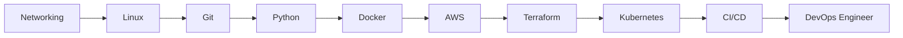

  

<h1 align="center">
  
  Hi, I'm <a href="https://koushikportfolio.vercel.app/" target="_blank">Koushik Roy</a>
</h1>
<h3 align="center">🌐 Network Engineer | Data Center & Cloud Infrastructure | DevOps | CCNA Certified</h3>

  
  
  

---

### 📌 About Me

I'm a **Network Engineer** with hands-on experience in **Data Center Operations** and **Enterprise Networking** at **NTT DATA** and **IBM**.

Currently, I am **transitioning into Cloud Infrastructure and DevOps** by building hands-on projects in:
- 🐧 **Linux Administration**
- 🐍 **Python Automation**
- 🐳 **Docker & Containerization**
- ☁️ **AWS Cloud Services**
- 🏗️ **Terraform (IaC)**
- ☸️ **Kubernetes Orchestration**
- 🔄 **CI/CD Pipelines**
- ⚙️ **Infrastructure as Code & Automation**

I enjoy designing **scalable, automated, and reliable infrastructure** by combining networking, cloud, and DevOps practices.

🔹 **Current Focus:** Network Automation, Cloud Networking, and DevOps Toolchain  
🔹 **Sharing my journey:** <a href="https://github.com/Koushikroy99/July2026_Koushik_Pathnex" target="_blank">#30DaysOfDevOps</a>

---

### 🛠️ Tech Stack & Skills

> *Following the DevOps Roadmap 2026*

#### ☁️ Cloud Fundamentals

#### 📦 Containerization & Orchestration

#### 🏗️ Infrastructure as Code & Configuration Management

#### 🔄 CI/CD & Automation

#### 📊 Observability & Monitoring 

#### 📨 Messaging & Streaming

#### 🖥️ Foundations (Linux, Git, Scripting)

#### 🌐 Networking & Data Center *(My Core Background)*

---

### 💼 Professional Experience

#### 🟦 MS Engineer – Network | NTT Global Data Centers, Chennai *(Apr 2026 – Present)*
Supporting critical Data Centre network operations for **High Frequency Trading (HFT)** environments with focus on high availability, reliability, and low latency connectivity.

- 24×7 Data Centre network operations, monitoring, proactive health checks, and incident troubleshooting.
- Rack & stack, network device installation, structured cabling, and physical infrastructure deployment.
- Maintain rack layouts, cable management, asset inventory, and infrastructure documentation.
- Coordinate with vendors and internal teams for hardware deployment, maintenance, and incident resolution.
- Follow Incident Management, Change Management, and SLA driven operational processes.
- **DevOps alignment:** Python automation for network health checks and operational efficiency.

---

#### 🟦 Network Engineer | IBM, Bengaluru *(Jul 2022 – Sep 2025)*
End-to-end troubleshooting of enterprise LAN/WAN networks with Cisco routers, switches, and firewalls.

- Configured routing protocols: **OSPF, EIGRP, BGP, RIP, Static Routes, VRFs**
- Implemented **VLANs, VTP, STP/RSTP/MSTP, EtherChannel, DHCP, NAT**
- Configured **HSRP/VRRP** for high availability and seamless failover
- Managed **Cisco ASA firewalls** – security zones, ACLs, NAT, VPNs (Site-to-Site & Remote Access IPSec)
- Packet-level analysis using **Wireshark** and log monitoring for troubleshooting
- ASA High Availability (Active/Standby) configuration, firmware upgrades, and patch management
- Operational support for **Palo Alto** and **FortiGate** firewalls
- **DevOps alignment:** Automated backup and configuration validation using Python & Ansible

---

#### 🟦 Co-Founder | <a href="https://www.axiomfluxtech.com/" target="_blank">AxiomFlux Tech</a> *(2024 – Present)*
Building immersive 3D experiences and AI-powered MVPs for startups. Specializing in turning complex ideas into market-ready products that stand out.

**Recent Projects:**
- <a href="https://cloudsourceusa.com/" target="_blank">Cloud Source USA</a> – Website development
- <a href="https://adiantex.com/" target="_blank">Adiantex</a> – Website development
- <a href="https://ashleyandalvis.com/" target="_blank">Ashley and Alvis</a> – Website development
- <a href="https://hgconstruction.in/" target="_blank">HG Construction</a> – Website development
- <a href="https://rkmaramharipur.org/" target="_blank">RKM Ramharipur</a> – Website development
- <a href="https://www.rkmvmidnapore.org/" target="_blank">RKM Vidyaniketan Midnapore</a> – Website development
- <a href="https://wealthwatchermanagement.com/" target="_blank">Wealth Watcher Management</a> – Website development

---

#### 🟦 Founder | <a href="https://www.safetrackid.com/" target="_blank">SafeTrackID</a> *(Aug 2025 – Present)*
Built a complete digital identity protection platform from the ground up — from architecture design to full-stack development and production deployment.

---

### 📚 Certifications & Training

| Certification | Issuer | Date | Certificate |
|---------------|--------|------|-------------|
| **CCNA** (200-301) | Cisco | March 2025 |  |
| **CCNP** (Trained) | N/A | February 2024 | — |
| Network Addressing & Troubleshooting | Cisco Networking Academy | December 2023 |  |
| Networking Basics | Cisco Networking Academy | October 2023 |  |
| **AWS Certified Cloud Practitioner** *(in progress)* | AWS | TBD | 🔄 In Progress |

---

### 🎓 Education

- **BCA** – Michael Madhusudan Memorial College, Durgapur *(CGPA: 8.56)*

---

### 🚀 DevOps Learning Roadmap

### 🏗️ Projects

#### 🏠 SOHO Network Design
- Designed a complete LAN setup with VLANs, DHCP, and inter-VLAN routing
- Conducted bandwidth monitoring and connectivity optimization

#### 🏫 University Campus Network
- Built a multi-campus WAN using OSPF and static routing
- Implemented VLAN segmentation, DHCP services, and security policies

---

### 📊 GitHub Analytics

  
  
  

---

### 📫 Connect With Me

  
  
  

---

### 📞 Contact Details

📧 **Email:** koushikroy05042001@gmail.com  
💼 **LinkedIn:** [linkedin.com/in/koushikroy99](https://www.linkedin.com/in/koushikroy99)  
🐦 **Twitter/X:** [@koushikroyfx](https://x.com/koushikroyfx)  
🌐 **Portfolio Website:** [koushikportfolio.vercel.app](https://koushikportfolio.vercel.app/)  
📱 **Phone:** +91 8345910586 | 9883827329

---

<h3 align="center">“Connecting networks, empowering systems, and building secure infrastructures.” </h3>
